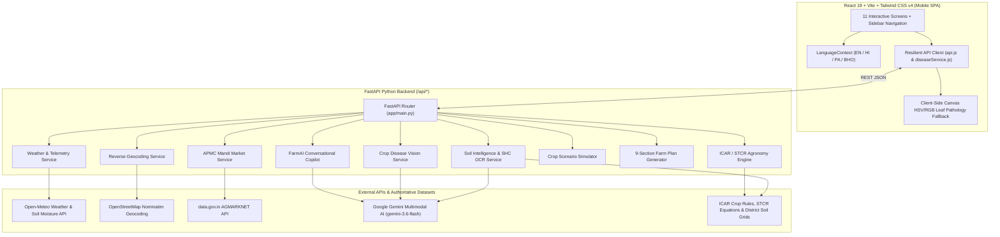

# AgriNexus (FarmAI) — Agricultural Decision Intelligence Platform

**AgriNexus (FarmAI)** is a mobile-first, multilingual agricultural decision intelligence platform engineered for Indian farmers. It combines **deterministic ICAR / STCR agronomy**, **live satellite & meteorological telemetry**, **APMC mandi market intelligence**, and **Google Gemini multimodal AI** into an interactive 11-screen mobile experience with strict **per-factor data provenance**.

---

## Key Highlights

- **Strict 4-Tier Data Provenance**: Every metric, price, soil parameter, and recommendation carries an auditable provenance badge (`LIVE`, `VERIFIED`, `ESTIMATED`, or `DEMO`) detailing its exact source, timestamp, geographic scope, and methodology.
- **Instant `DEMO` ↔ `LIVE` Mode Switching**: Toggle seamlessly between deterministic benchmark data (`DEMO`) and real-time coordinate-calibrated APIs & Gemini AI (`LIVE`) from the top status bar or sidebar drawer.
- **Zero-Hallucination Agronomy & Economics**:
  - Fertilizer schedules are computed deterministically using **ICAR Recommended Dose of Fertilizers (RDF)** and **Soil Test Crop Response (STCR)** equations (`Urea`, `DAP`, `MOP`, `Zinc Sulphate`).
  - Financial projections report **bounded gross revenue ranges** from official **AGMARKNET / APMC modal prices** without fabricating unverified net profit claims.
- **Multilingual & Voice-First Accessibility**: Full localization across **English**, **Hindi (`हिन्दी`)**, **Punjabi (`ਪੰਜਾਬੀ`)**, and **Bhojpuri (`भोजपुरी`)**, plus Web Speech API voice input and text-to-speech audio playback.
- **Resilient Offline-Ready Client**: Transparently falls back to coordinate-calibrated local engines and HTML5 Canvas HSV/RGB foliar pathology analysis if the backend or internet connection drops.

---

## Complete 11-Screen Feature Walkthrough

| Screen | Module | Capabilities |
| :--- | :--- | :--- |
| **1. Welcome** | `ScreenWelcome` | Onboarding portal with quick-launch into farm analysis or demo walkthrough. |
| **2. Language Selection** | `ScreenLanguage` | Instant localization across **English**, **Hindi (`हिन्दी`)**, **Punjabi (`ਪੰਜਾਬੀ`)**, and **Bhojpuri (`भोजपुरी`)**. |
| **3. Field Location & Boundary** | `ScreenLocation` | Interactive **Leaflet satellite map** with 4-corner polygon boundary dragging, GPS auto-detection, **Nominatim reverse geocoding**, and adjustable land size presets (`Acres` / `Hectares`). |
| **4. Land & Weather Analysis** | `ScreenDashboard` | Real-time **Open-Meteo** surface temperature & soil moisture, **IMD** 30-year rainfall normals, coordinate-calibrated **NDVI**, and **SRTM DEM** elevation/slope metrics. |
| **5. Cropping Pattern** | `ScreenCroppingPattern` | 5-year district-level seasonal crop distribution (`Kharif`, `Rabi`, `Zaid`) and historical rotation insights from DES registries. |
| **6. Crop Recommendations** | `ScreenRecommendations` | Deterministic biophysical suitability scoring (`High` / `Moderate` suitability) for **Rice**, **Maize**, and **Wheat**, paired with **ICAR-STCR fertilizer guidance**. |
| **7. Mandi Market Prices** | `ScreenMarketPrices` | Daily **AGMARKNET (`data.gov.in`)** modal, min, and max prices (`₹/Quintal`) ranked by **Haversine distance** to nearby APMC mandis. |
| **8. FarmAI Copilot** | `ScreenCopilot` | Context-aware conversational AI assistant powered by **Google Gemini**, grounded in your active parcel coordinates, soil pH, crop selection, and language with voice I/O. |
| **9. Crop Disease Detection** | `ScreenCropDisease` | **Camera capture** or **photo upload** leaf diagnostic engine using **Gemini Multimodal Vision** + **HTML5 Canvas HSV/RGB colorimetric lesion analysis** for pathogen identification, severity scoring, and ICAR treatment protocols. |
| **10. Soil Intelligence & SHC OCR** | `ScreenSoilIntelligence` | 12-parameter regional soil baseline (`pH`, `EC`, `OC`, `N`, `P`, `K`, `S`, `Zn`, `Fe`, `Bo`, `Cu`, `Mn`) + **Multimodal Optical Digitization** of uploaded **Soil Health Cards (Image/PDF)**. |
| **11. Scenario Simulator & Farm Plan** | `ScreenScenarioSimulator` & `ScreenFarmPlan` | Side-by-side **Crop Scenario Comparison** (`Crop A` vs `Crop B` water, fertilizer, duration, and gross revenue) and a comprehensive **9-Section Personalized Farm Plan** with a 6-stage chronological action timeline. |

---

## System Architecture



---

## Tech Stack

### Frontend
- **Framework**: React 19 (`react`, `react-dom`) + Vite 8
- **Styling**: Tailwind CSS v4 (`@tailwindcss/vite`)
- **Geospatial & Mapping**: Leaflet (`leaflet`, `react-leaflet`) with Esri World Imagery satellite tiles
- **Icons**: Lucide React (`lucide-react`)
- **Browser APIs**: HTML5 Canvas API (pixel-level leaf lesion analysis), Web Speech API (`SpeechRecognition` & `speechSynthesis`), MediaDevices Camera API

### Backend
- **Framework**: FastAPI + Uvicorn (`ASGI`)
- **Validation**: Pydantic v2 strict schemas (`app/models/schemas.py`)
- **AI / Multimodal LLM**: Google GenAI SDK (`google-genai`) for Crop Disease Vision, Soil Health Card OCR, and Copilot Chat
- **HTTP Client**: `httpx` (async requests to Open-Meteo and Nominatim)

---

## Project Structure

```text
AgriNexus-main/
├── Dockerfile                        # Multi-stage Docker build (Node 22 + Python 3.12)
├── docker-compose.yml                # Single-command container orchestration
├── .dockerignore                     # Excludes node_modules, caches, and .env from image
├── .gitignore                        # Git ignore rules for Python, Node, and secrets
├── package.json                      # Root scripts to run frontend + backend concurrently
├── backend/
│   ├── requirements.txt              # Python backend dependencies
│   ├── .env.example                  # Template for environment variables & API keys
│   └── app/
│       ├── main.py                   # FastAPI application & REST endpoints + SPA static server
│       ├── models/
│       │   └── schemas.py            # Pydantic v2 request/response & provenance schemas
│       ├── services/
│       │   ├── agronomy_engine.py    # Deterministic ICAR crop suitability & STCR fertilizer math
│       │   ├── weather_service.py    # Open-Meteo live telemetry & IMD normals
│       │   ├── geocoding_service.py  # Nominatim reverse geocoding with caching
│       │   ├── market_service.py     # AGMARKNET (data.gov.in) prices & Haversine mandi ranking
│       │   ├── soil_service.py       # 12-parameter soil grids & Gemini SHC optical extraction
│       │   ├── disease_service.py    # Gemini Vision leaf pathology & ICAR treatment lookup
│       │   ├── copilot_service.py    # Grounded multilingual agricultural AI assistant
│       │   ├── scenario_service.py   # Side-by-side Crop A vs Crop B simulator
│       │   └── farm_plan_service.py  # 9-section Personalized Farm Plan synthesizer
│       ├── data/                     # Authoritative ICAR rules, APMC directories & soil JSONs
│       └── utils/
│           └── geo_utils.py          # Haversine distance & spatial helper functions
└── frontend/
    ├── package.json                  # Frontend dependencies & Vite scripts
    ├── index.html                    # Mobile viewport entry point
    └── src/
        ├── App.jsx                   # Root state machine, mode switcher & screen router
        ├── context/
        │   └── LanguageContext.jsx   # Multilingual dictionary & translation provider
        ├── services/
        │   ├── api.js                # REST API client + resilient coordinate-calibrated fallbacks
        │   ├── diseaseService.js     # Disease API client + HTML5 Canvas HSV/RGB foliar analyzer
        │   └── mockData.js           # Offline benchmark dataset
        └── components/               # All 11 screen components + MobileFrame + ProvenanceBadge
```

---

## Environment Variables & API Keys

Create a `backend/.env` file by copying [`backend/.env.example`](backend/.env.example):

```bash
cp backend/.env.example backend/.env
```

| Variable | Required? | Description | Where to Get It |
| :--- | :---: | :--- | :--- |
| `GEMINI_API_KEY` | **Recommended** | Powers **FarmAI Copilot**, **Crop Disease Vision**, and **Soil Health Card OCR** in `LIVE` mode. | [Google AI Studio](https://aistudio.google.com/app/apikey) |
| `GEMINI_MODEL` | Optional | Gemini model identifier (defaults to `gemini-3.6-flash`). | Configurable in `backend/.env` |
| `DATA_GOV_IN_API_KEY` | Optional | Fetches live daily APMC mandi commodity prices from **AGMARKNET**. | [data.gov.in](https://data.gov.in/) |

> **Note**: **Open-Meteo** (live weather & soil moisture), **OpenStreetMap Nominatim** (reverse geocoding), and **Esri World Imagery** (satellite map tiles) work out-of-the-box with **no API key required**.

---

## Getting Started

### Option 1: Run with Docker Compose (Quickest)

1. Ensure [Docker Desktop](https://www.docker.com/products/docker-desktop/) is installed and running.
2. (Optional) Configure your API keys in `backend/.env`.
3. Build and start the container:
   ```bash
   docker compose up --build
   ```
4. Open **`http://localhost:8000`** in your browser.

---

### Option 2: Run Locally (Node.js + Python)

#### Prerequisites
- **Node.js** `v18+` (or `v22+`)
- **Python** `3.10+` (or `3.12+`)

#### 1. Install Dependencies
```bash
# Install root and frontend dependencies
npm install
cd frontend && npm install && cd ..

# Install backend Python dependencies
pip install -r backend/requirements.txt
```

#### 2. Start Both Servers Concurrently
From the project root:
```bash
npm run dev
```
Or run them in separate terminals:
- **Backend (Port `8000`)**:
  ```bash
  cd backend
  python -m uvicorn app.main:app --reload --port 8000
  ```
- **Frontend (Port `5173`)**:
  ```bash
  cd frontend
  npm run dev
  ```
- Open **`http://localhost:5173`** in your browser (interactive Swagger API docs are available at **`http://localhost:8000/docs`**).

---

## REST API Reference

| Method | Endpoint | Description |
| :---: | :--- | :--- |
| `GET` | `/api/health` | Health check and active Gemini model configuration. |
| `GET` | `/api/geocode` | Reverse geocodes `lat` & `lng` to village, district, and state with provenance. |
| `GET` | `/api/land-analysis` | Returns temperature, soil moisture, annual rainfall, NDVI, elevation, slope, and soil pH. |
| `GET` | `/api/cropping-pattern` | Returns 5-year seasonal cropping distribution and rotation history for a district. |
| `GET` | `/api/mandi-prices` | Returns APMC mandi modal/min/max prices and Haversine-ranked nearby mandis. |
| `GET` | `/api/soil/intelligence` | Returns 12-parameter soil profile (`pH`, `EC`, `OC`, `N`, `P`, `K`, `S`, `Zn`, `Fe`, `Bo`, `Cu`, `Mn`). |
| `POST` | `/api/soil/upload-card` | Extracts 12 soil parameters from an uploaded Soil Health Card image/PDF via Gemini OCR. |
| `GET` | `/api/recommendations` | Evaluates ICAR crop suitability and deterministic STCR fertilizer schedules. |
| `POST` | `/api/copilot/chat` | Conversational agricultural Copilot grounded in parcel telemetry and farm context. |
| `POST` | `/api/disease/detect` | Multimodal leaf disease diagnosis returning pathogen, confidence, symptoms, and actions. |
| `POST` | `/api/scenario/compare` | Simulates a side-by-side comparison between two crops (`crop_a_id` vs `crop_b_id`). |
| `POST` | `/api/farm-plan` | Generates a complete 9-section Personalized Farm Plan for the selected crop and parcel. |
